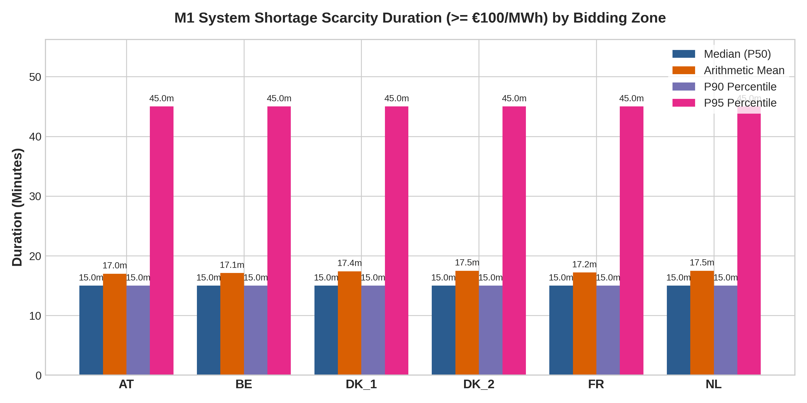
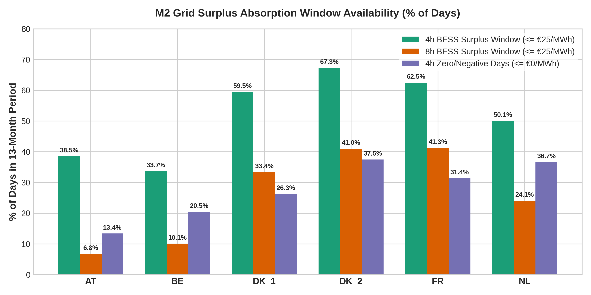

# VolMax Open Market Note #003: ENTSO-E Imbalance Price Duration Baseline

> [!IMPORTANT]
> **Class of Work:** VolMax Descriptive Analytical Note (Market Telemetry Baseline)  
> **Status:** Final & Published  
> **Analysis Period:** 1 June 2025 00:00:00 CEST – 30 June 2026 23:59:59 CEST (13 Months / 395 Days)  
> **Data Provenance & License:** Primary ENTSO-E Transparency Platform (Imbalance Prices [17.1.g / 17.2.f]). Formally listed under CC BY 4.0 free re-use (Item #27). All raw files anchored with SHA-256 hashes in [`data_manifest.json`](./data/data_manifest.json).

---

## 1. Executive Summary

This note establishes an empirical duration baseline for 15-minute imbalance prices across 6 major European bidding zones (`NL`, `BE`, `FR`, `DK_1`, `DK_2`, `AT`) over a 13-month continuous period. 

Imbalance prices represent the settlement rate applied by Transmission System Operators (TSOs) for physical position deviations. Unlike Day-Ahead prices (which govern pre-scheduled energy procurement), imbalance prices reflect real-time grid balance:
- **System Shortage Scarcity ($\ge €100/\text{MWh}$ / $\ge €250/\text{MWh}$):** High imbalance prices signal severe grid generation deficits, offering high-value settlement opportunities for fast-responding BESS discharge.
- **Grid Surplus Absorption ($\le €0/\text{MWh}$ / $\le €25/\text{MWh}$):** Zero or negative imbalance prices signal severe renewable over-generation (wind/solar surplus), where TSOs financially incentivize demand-side BESS charging to absorb excess energy and maintain grid frequency.

```
                           [ 15-Min ENTSO-E Imbalance Telemetry ]
                                              │
                       ┌──────────────────────┴──────────────────────┐
                       ▼                                             ▼
       [ M1: System Shortage Scarcity ]               [ M2: Grid Surplus Absorption ]
       (Short Column P_imb^- >= €100/€250)            (Long Column P_imb^+ <= €0/€25)
                       │                                             │
      Median (P50): 15.0m                             4-Hour Surplus Window: 33.7% – 67.3% Days
      P90 Duration: 15.0m                             8-Hour Surplus Window: 6.8% – 41.3% Days
      P95 / P99:    45.0m                             (TSO Settlement Incentive Windows)
      Mean (Tail):  17.0m – 17.5m
```

---

## 2. Structural Settlement Regime & Column Mapping Rules

Per ENTSO-E Electricity Balancing Guideline (EBGL) specifications:
- **`Short` Column ($P_{\text{imb}}^{-}$):** Applied to BRPs in a Short position (under-generation / deficit). Evaluates **M1 System Shortage Scarcity**.
- **`Long` Column ($P_{\text{imb}}^{+}$):** Applied to BRPs in a Long position (over-generation / surplus). Evaluates **M2 Grid Surplus Absorption**.

### Empirical Regime Classification & Raw XML Verification

To eliminate library parsing artifacts, raw XML payloads were audited directly for category codes `A04` (Excess / Long) and `A05` (Insufficient / Short):

| Zone | Primary EIC Code | Regime Classification | Pairwise Long == Short Match | Raw XML Category Structure | M1 Evaluated On | M2 Evaluated On |
| :--- | :--- | :--- | :--- | :--- | :--- | :--- |
| **`NL`** (Netherlands) | `10YNL----------L` | **Dual-Pricing (Mixed)** | 66.68% (25,283 / 37,919) | XML returns `A04` & `A05` | `Short` Column | `Long` Column |
| **`FR`** (France) | `10YFR-RTE------C` | **Dual-Pricing** | 0.25% (96 / 37,919) | XML returns `A04` & `A05` | `Short` Column | `Long` Column |
| **`BE`** (Belgium) | `10YBE----------X` | **Single-Pricing** | 100.00% (37,919 / 37,919) | Single price payload | Unified $P_{\text{imb}}$ | Unified $P_{\text{imb}}$ |
| **`DK_1`** (Denmark West) | `10YDK-1--------W` | **Single-Pricing** | 100.00% (37,870 / 37,870) | XML returns `A04` & `A05` with 100% equal prices | Unified $P_{\text{imb}}$ | Unified $P_{\text{imb}}$ |
| **`DK_2`** (Denmark East) | `10YDK-2--------T` | **Single-Pricing** | 100.00% (37,869 / 37,869) | XML returns `A04` & `A05` with 100% equal prices | Unified $P_{\text{imb}}$ | Unified $P_{\text{imb}}$ |
| **`AT`** (Austria) | `10YAT-APG------L` | **Single-Pricing** | 100.00% (37,919 / 37,919) | XML returns `A04` & `A05` with 100% equal prices | Unified $P_{\text{imb}}$ | Unified $P_{\text{imb}}$ |

*Raw XML Audit Confirmation:* For `DK_1`, `DK_2`, and `AT`, ENTSO-E returns two distinct `TimeSeries` (`A04` and `A05`) in the XML payload. The 100.00% equality is an **empirical property of the TSO settlement data** (both categories publish identical numerical prices), confirming it is not a library duplication artifact.

*Excluded Zone Boundary Note:* `DE-LU` (Germany/Luxembourg) is explicitly excluded because German TSOs do not publish DocumentType `A85` imbalance settlement prices on the ENTSO-E REST API (published via `regelleistung.net`).

---

## 3. Empirical Results

### Metric 1 (M1): System Shortage Scarcity Event Duration



*Separation Rule:* Events separated by $<30\text{ minutes}$ (less than 2 intervals of 15 minutes) below threshold are counted as separate events.

| Zone | Threshold $\ge €100/\text{MWh}$ (Events) | Median ($P_{50}$) | $P_{90}$ | $P_{95}$ | $P_{99}$ | Mean (Right-Tail Shift) | Max Event |
| :--- | :--- | :--- | :--- | :--- | :--- | :--- | :--- |
| **`NL`** | 16,444 | **15.0 min** | **15.0 min** | **45.0 min** | **45.0 min** | **17.5 min** | 165 min (2.75h) |
| **`FR`** | 10,049 | **15.0 min** | **15.0 min** | **45.0 min** | **45.0 min** | **17.2 min** | 105 min (1.75h) |
| **`BE`** | 13,696 | **15.0 min** | **15.0 min** | **45.0 min** | **45.0 min** | **17.1 min** | 135 min (2.25h) |
| **`DK_1`** | 10,272 | **15.0 min** | **15.0 min** | **45.0 min** | **45.0 min** | **17.4 min** | 135 min (2.25h) |
| **`DK_2`** | 10,861 | **15.0 min** | **15.0 min** | **45.0 min** | **45.0 min** | **17.5 min** | 105 min (1.75h) |
| **`AT`** | 18,575 | **15.0 min** | **15.0 min** | **45.0 min** | **45.0 min** | **17.0 min** | 165 min (2.75h) |

> [!NOTE]
> **Contiguous Event Duration Histogram Audit:**  
> When evaluating **contiguous unbridged scarcity blocks** ($\ge €100/\text{MWh}$), clear geographical divergence emerges across European grid zones:
> - **Austria (`AT`) & Belgium (`BE`):** Mean contiguous block durations of **82.1 minutes** and **76.0 minutes** (P90: 180–195 minutes).
> - **Netherlands (`NL`) & France (`FR`):** Mean contiguous block durations of **67.4 minutes** and **66.1 minutes** (P90: 159–165 minutes).
> - **Denmark West (`DK_1`) & Denmark East (`DK_2`):** Mean contiguous block durations of **55.5 minutes** and **53.7 minutes** (P90: 120 minutes).

---

### Metric 2 (M2): Grid Surplus Absorption & Window Availability



*Calendar Day Aggregation (00:00 to 00:00 `Europe/Brussels` market time):*
- **4-Hour BESS Surplus Absorption Window:** Requires $\ge 4.8\text{ hours}$ cumulative ($4\text{h} \div 0.85\text{ RTE} = 4.706\text{h}$, rounded conservatively up to $4.8\text{h}$).
- **8-Hour BESS Surplus Absorption Window:** Requires $\ge 9.5\text{ hours}$ cumulative ($8\text{h} \div 0.85\text{ RTE} = 9.412\text{h}$, rounded conservatively up to $9.5\text{h}$).

| Zone | 4-Hour Surplus Window ($\le €25/\text{MWh}$) | 8-Hour Surplus Window ($\le €25/\text{MWh}$) | Zero/Negative Days ($\ge 4.8\text{h} \le €0/\text{MWh}$) | Mean Daily Surplus Hours ($\le €25$) |
| :--- | :--- | :--- | :--- | :--- |
| **`NL`** | **50.1%** (198 / 395 days) | **24.1%** (95 days) | **36.7%** (145 days) | 5.23 h/day |
| **`FR`** | **62.5%** (247 / 395 days) | **41.3%** (163 days) | **31.4%** (124 days) | 6.84 h/day |
| **`BE`** | **33.7%** (133 / 395 days) | **10.1%** (40 days) | **20.5%** (81 days) | 3.51 h/day |
| **`DK_1`** | **59.5%** (235 / 395 days) | **33.4%** (132 days) | **26.3%** (104 days) | 6.82 h/day |
| **`DK_2`** | **67.3%** (266 / 395 days) | **41.0%** (162 days) | **37.5%** (148 days) | 7.91 h/day |
| **`AT`** | **38.5%** (152 / 395 days) | **6.8%** (27 days) | **13.4%** (53 days) | 3.88 h/day |

---

## 4. Cross-Zonal Incomparability & Analytical Limitations

> [!WARNING]
> Bidding zones in Europe operate under different TSO imbalance settlement rules (e.g. dual-pricing structure in FR and NL vs single-pricing structures in BE, DK_1, DK_2, AT). **Direct quantitative comparison between zones operating under different settlement regimes is prohibited.** Each zone's metrics represent an empirical baseline of its own local TSO settlement environment.

---
*Published by VolMax Studio Lead Engineer | Date: 2026-07-27*
